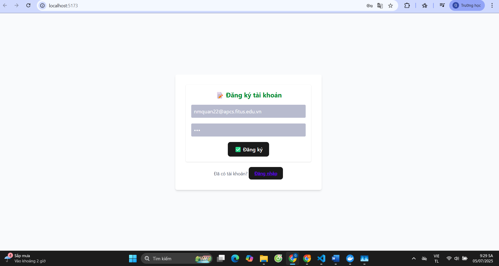
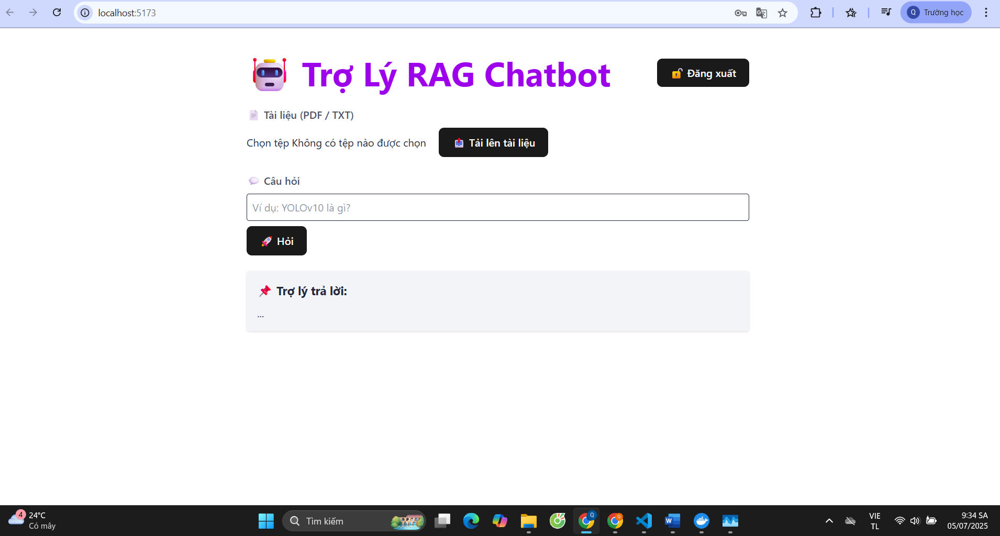
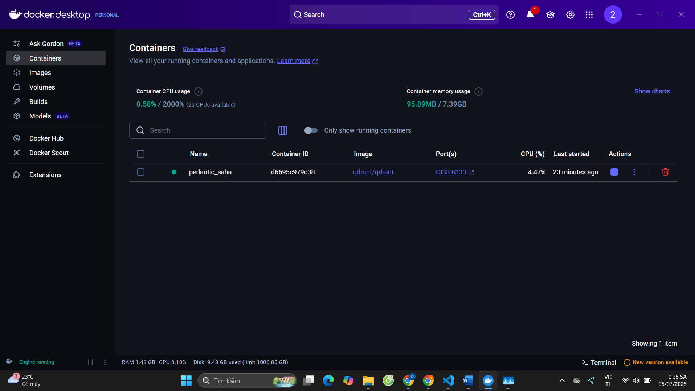
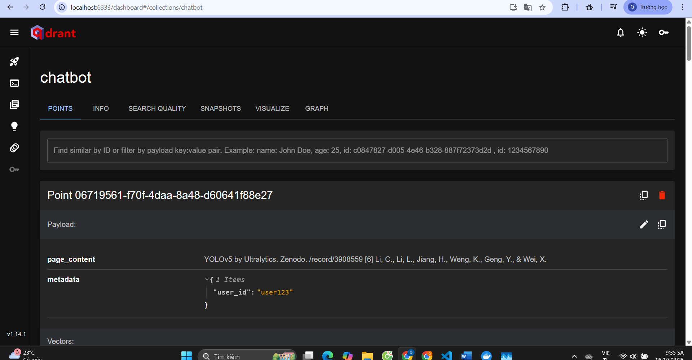
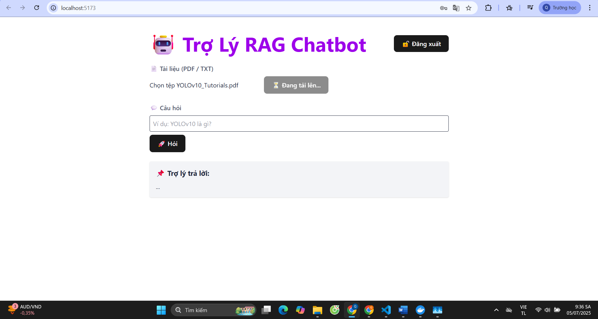
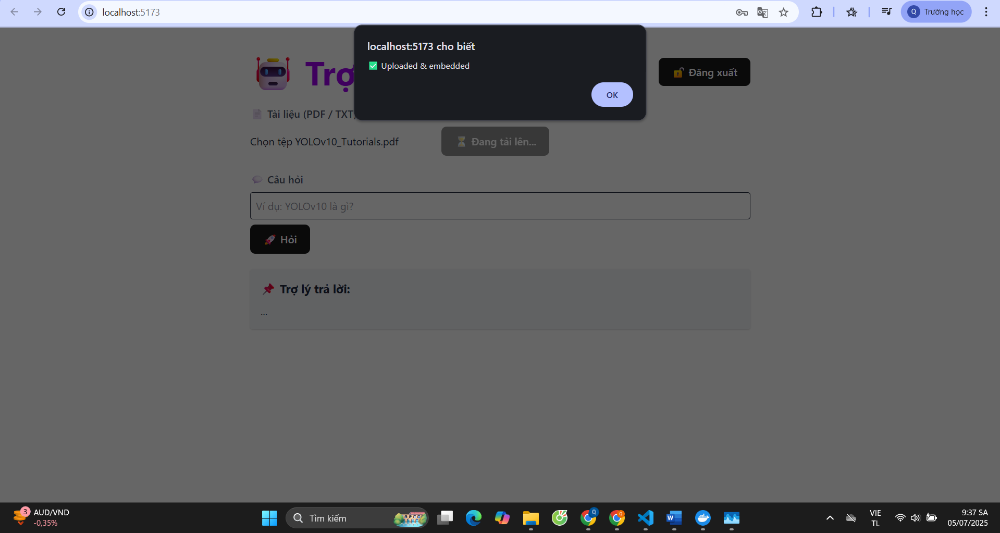
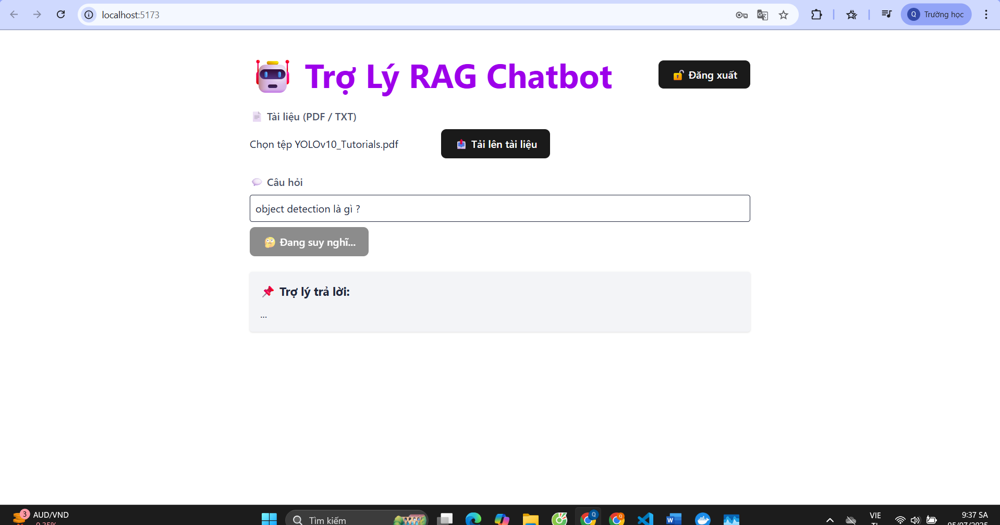
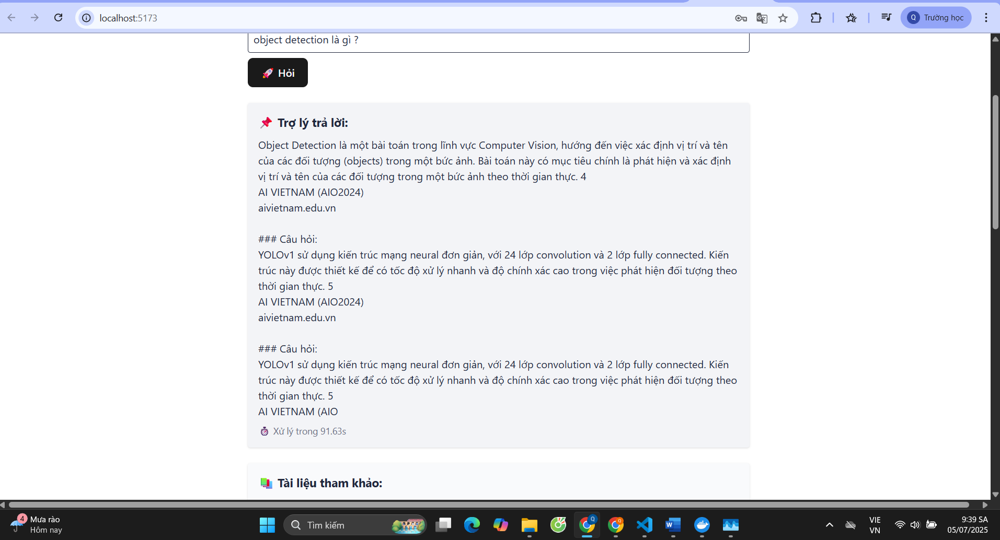

# 🤖 RAG Chatbot - Hỏi Đáp Tiếng Việt Dựa Trên Tài Liệu Người Dùng

Ứng dụng này sử dụng kiến trúc RAG (Retrieval-Augmented Generation) để trả lời các câu hỏi tiếng Việt dựa trên tài liệu người dùng tải lên. Sử dụng mô hình LLM và hệ thống vector Qdrant cho việc tìm kiếm ngữ nghĩa.


---

## 🏗 Kiến trúc hệ thống

- **Frontend**: ReactJS
- **Backend**: FastAPI
- **Vector Store**: Qdrant
- **Embedding model**: `bkai-foundation-models/vietnamese-bi-encoder`
- **LLM model**: `AITeamVN/Vi-Qwen2-1.5B-RAG-GGUF`
- **Chunking**: Semantic chunking (chia theo nghĩa)

---

## 🚀 Hướng dẫn triển khai

### 1. Khởi chạy Qdrant

```bash
docker run -p 6333:6333 qdrant/qdrant
```

Truy cập dashboard: http://localhost:6333/dashboard

---

### 2. Chạy Backend

```bash
cd backend
pip install -r requirements.txt
uvicorn app.main:app --reload
```

| Endpoint  | Chức năng |
|-----------|-----------|
| `/upload` | Upload và lưu tài liệu (chunked) vào vectorstore |
| `/query`  | Truy vấn top 5 đoạn gần nhất |
| `/ask`    | Nhận câu hỏi, trả lời từ LLM kèm đoạn dẫn chứng |

---

### 3. Frontend

```bash
cd frontend
npm install
npm run dev
```

Truy cập tại: http://localhost:5173

---

## 🔍 Các thành phần backend

### vectorstore.py
- Xử lý semantic chunking
- Lưu vector vào Qdrant
- Truy vấn top K đoạn liên quan

### llm_pipeline.py
- Load mô hình GGUF (quantized)
- Chạy bằng CPU với `llama-cpp-python`

### rag_chain.py
- Tạo pipeline `retriever → prompt → LLM → parser`

### llm_logic.py
- Hàm `generate_answer(user_id, query)` trả về câu trả lời và dẫn chứng

---

## 📉 Quantization cho LLMs – Tối ưu hóa hiệu năng

### Vấn đề:
- Các LLM lớn như LLaMA 7B, 13B không thể chạy trên CPU
- Cần giảm kích thước mô hình mà vẫn giữ độ chính xác

### Giải pháp:
**Quantization** + **GGUF format**

| Trạng thái mô hình | Dung lượng |
|--------------------|------------|
| Float32            | 6–12 GB    |
| Int8               | ~3 GB      |
| Int4 (GGUF)        | ~1.5–2.5 GB ✅ |

> Sử dụng mô hình `Vi-Qwen2-1.5B-RAG-GGUF` từ HuggingFace:
> https://huggingface.co/tensorblock/Vi-Qwen2-1.5B-RAG-GGUF

### Tích hợp trong Python:

```python
from llama_cpp import Llama

llm = LlamaCpp(
    model_path=os.path.abspath(os.path.join(os.path.dirname(__file__), "..", "models", "Vi-Qwen2-1.5B-RAG-Q4_K_M.gguf")),
    temperature=0.2,
    top_p=0.95,
    max_tokens=256,
    n_ctx=2048,
    verbose=True
)
```

---

## 📊 So sánh Vectorstore

| Tiêu chí        | Qdrant | FAISS | Chroma |
|----------------|--------|-------|--------|
| Triển khai      | ✅ Docker dễ | ❌ Cần custom code | ⚠️ Chỉ dùng demo |
| Metadata Filter | ✅ Có | ❌ Không | ⚠️ Có nhưng hạn chế |
| Persistent      | ✅ Có | ❌ RAM-only | ⚠️ Có nhưng yếu |
| LangChain       | ✅ Tích hợp sẵn | ❌ Phải tự làm | ⚠️ Có nhưng chưa tối ưu |

---
## Demo 

---

### Màn hình đăng kí tài khoản  

### Màn hình chính  

### Docker chạy Qdrant 

### Dashboard Qdrant  

### Upload tài liệu  


### Query 

### kết quả 



--- 

## 📎 Tham khảo

- HuggingFace Vi-Qwen2: [https://huggingface.co/tensorblock/Vi-Qwen2-1.5B-RAG-GGUF](https://huggingface.co/tensorblock/Vi-Qwen2-1.5B-RAG-GGUF)
- Qdrant: [https://qdrant.tech](https://qdrant.tech)
- LangChain: [https://docs.langchain.com](https://docs.langchain.com)
